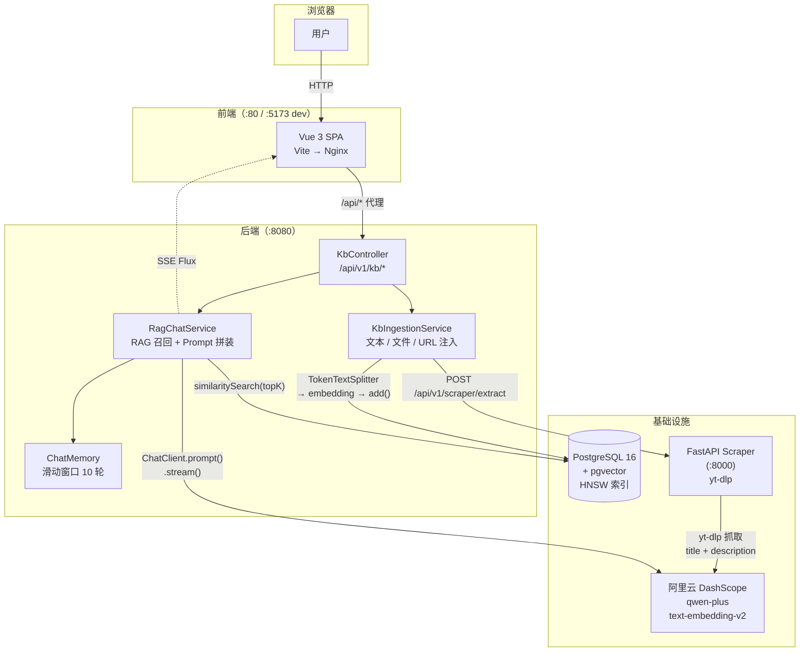
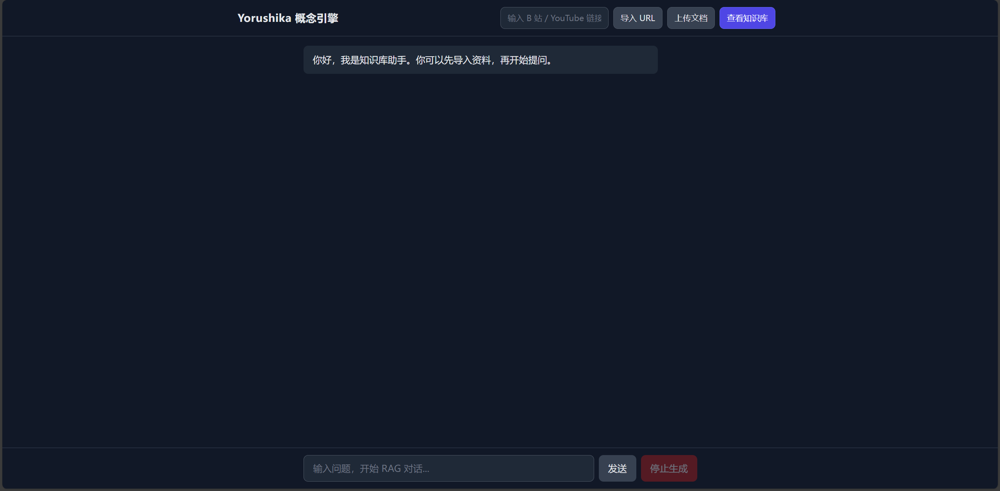
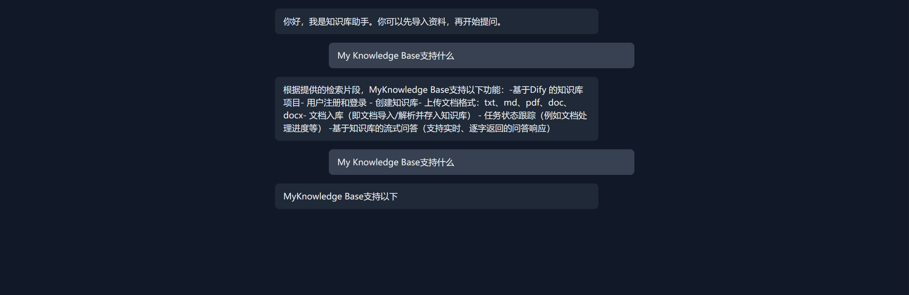

<div align="center">

# RAG-Nexus

[](https://spring.io/projects/spring-boot)
[](https://docs.spring.io/spring-ai/reference/)
[](https://vuejs.org/)
[](https://fastapi.tiangolo.com/)
[](https://github.com/pgvector/pgvector)
[](LICENSE)
[](src/test/java/com/ragnexus/kb/controller/KbControllerTest.java)

**基于 Spring AI + pgvector 的全栈 RAG 知识库问答系统**

支持文档（PDF / DOC / PPT）、纯文本、视频链接（B 站 / YouTube）三种内容注入，提供流式对话问答接口与 Vue 3 前端页面，一键 Docker Compose 部署。

</div>

---

## 项目定位

这是一个**工程原型项目**，完整实现了 RAG（检索增强生成）的核心链路，包含向量化存储、相似度召回、防幻觉 Prompt 设计和 SSE 流式输出。项目侧重工程实现与链路完整性，不具备生产级的权限管理、监控体系和高可用设计。

适合用于：个人知识库搭建、技术探索、RAG 实现学习参考。

> ⚠️ **安全警告**：本项目**所有 API 完全开放，无任何认证 / 鉴权 / 限流**，且全局异常处理已脱敏但仍非生产级。
> 仅限**本地或可信内网**运行。若需公网访问，请自行在前面加一层反向代理鉴权（nginx basic auth / API gateway / OAuth），
> 切勿将 8080 端口直接暴露到公网，否则任何人都能消耗你的 LLM 配额或篡改知识库。

---

## 核心功能

### 已实现

| 功能 | 说明 |
|------|------|
| **文本注入** | 接收原始文本，按 Token 分块后向量化写入 pgvector |
| **文件上传** | 使用 Apache Tika 解析 PDF / DOC / DOCX / PPT / TXT / MD，分块入库 |
| **URL 注入** | 调用 FastAPI 爬虫服务，通过 yt-dlp 抓取 B 站 / YouTube 视频标题与简介入库 |
| **RAG 问答** | 向量相似度召回 Top-K 切片，拼装 System Prompt 后调用 LLM 生成回答 |
| **SSE 流式问答** | 基于 `Flux<String>` 的 Server-Sent Events，前端实时渲染，支持手动中断 |
| **多轮对话记忆** | `MessageWindowChatMemory` 滑动窗口，每个 sessionId 保留最近 10 轮上下文 |
| **防幻觉约束** | System Prompt 明确限定"仅依据检索片段作答"；检测到异常回答时降级为直接引用证据片段 |
| **知识库统计** | 查询总 chunk 数、总文档数及各文档 chunk 分布 |
| **来源溯源** | 每条 chunk 写入 `docName / author / sourceType` metadata，问答回包携带 `citations` |
| **Vue 3 前端** | 暗色主题，含文档管理面板、流式对话、Markdown 渲染 |
| **Docker Compose** | 4 服务一键编排（pgvector / Python 爬虫 / Spring Boot / Vue+Nginx） |

### 暂未实现

| 功能 | 说明 |
|------|------|
| OCR | 仅支持含文本层的 PDF，扫描件 / 图片 PDF 无法解析 |
| 权限与认证 | 所有 API 当前完全开放，无 Spring Security |
| 持久化会话历史 | 会话记忆为内存级别，后端重启后丢失 |
| 监控与可观测性 | 无 Prometheus / 链路追踪等配置 |

### 测试覆盖

仓库目前包含 6 个 Controller 层 `@WebMvcTest` 切片测试，通过 Mockito 隔离后端服务依赖，覆盖请求校验、响应包装及异常响应。2026-09-23 本次审查执行 `mvn -o test`：6 个测试通过（0 失败、0 错误、0 跳过）。这些测试没有覆盖真实数据库、LLM、爬虫服务或完整 RAG 链路的端到端流程。

---

## 技术栈

| 层 | 技术 |
|----|------|
| **后端** | Spring Boot 3.4 / Java 17 / Spring AI 1.0 / Lombok |
| **前端** | Vue 3.5 / TypeScript / TailwindCSS 3.4 / Vite 5.4 |
| **AI 框架** | Spring AI（ChatClient / VectorStore / MessageChatMemoryAdvisor） |
| **LLM / Embedding** | 阿里云 DashScope `qwen-plus` + `text-embedding-v2`（1536 维）；兼容 OpenAI API |
| **向量存储** | PostgreSQL 16 + pgvector（HNSW 索引 + 余弦距离） |
| **文档解析** | Apache Tika（spring-ai-tika-document-reader） |
| **爬虫微服务** | Python 3.10 / FastAPI 0.115 / yt-dlp |
| **部署** | Docker Compose / 多阶段 Dockerfile（Java + Python + Vue/Nginx） |
| **API 文档** | Swagger UI（springdoc-openapi 2.6） |

---

## 系统架构



---

## 处理链路

### 内容注入链路

```
[方式 A] 纯文本 POST /api/v1/kb/ingest
    └─→ TokenTextSplitter (chunkSize=500, 可自定义)
         └─→ 写入 metadata: {docName, author, sourceType}
              └─→ EmbeddingModel (text-embedding-v2, 1536 维)
                   └─→ pgvector vector_store (HNSW + 余弦距离)

[方式 B] 文件上传 POST /api/v1/kb/upload
    └─→ Apache Tika 解析文本层 (PDF / DOC / PPT / TXT / MD)
         └─→ 同上分块 → embedding → pgvector

[方式 C] URL POST /api/v1/kb/ingest/url
    └─→ HTTP POST → FastAPI :8000/api/v1/scraper/extract
         └─→ yt-dlp 提取 title + description + uploader
              └─→ 同上分块 → embedding → pgvector
```

### 问答链路

```
用户提问 POST /api/v1/kb/chat (同步) 或 /chat/stream (SSE)
    └─→ vectorStore.similaritySearch(query, topK)    ← 向量召回
         └─→ buildRagSystemPrompt(召回片段)           ← Prompt 拼装
              约束：仅依据检索片段作答，不足以判断则明确说明
              └─→ ChatClient.prompt()
                   + MessageChatMemoryAdvisor         ← 注入多轮记忆
                   + temperature / topK (请求级可配)
                   └─→ qwen-plus 推理
                        ├─→ 同步返回 KbChatResponse {answer, citations}
                        └─→ SSE 流式 Flux<String> → 前端 ReadableStream
                             └─→ normalizeGarbledAnswer() 乱码兜底
```

---

## 工程亮点

**1. Spring AI 适配阿里云 DashScope**

Spring AI 默认对接 OpenAI，项目通过 `AiConfig.java` 显式构建 `OpenAiChatModel` 并注入兼容的 `base-url`，使用 `@ConditionalOnMissingBean` 防止与自动配置冲突。`base-url` 不含 `/v1` 后缀（Spring AI 自动拼接，否则出现 `/v1/v1/` 404）。

**2. 防幻觉 Prompt 设计 + 运行时降级**

`buildRagSystemPrompt()` 明确约束 LLM"仅依据检索片段回答"。检测到异常回答（如乱码占位）时，`isLikelyGarbled()` 触发降级，`buildEvidenceFallback()` 直接将召回片段原文返回，保证回答始终有依据可查。

**3. SSE 流式响应全链路打通**

`KbController` 返回 `Flux<String>`（`text/event-stream`），经 Nginx 反向代理（`proxy_buffering off`）到达前端；前端使用原生 `fetch` + `ReadableStream` + `AbortController` 实现打字机效果与中断按钮，全程不依赖第三方 SSE 库。

**4. 三源统一注入管道**

文本（直接分块）、文件（Tika 解析）、URL（yt-dlp 抓取）三种来源最终走同一条 `TokenTextSplitter → metadata 写入 → VectorStore.add()` 管道，每条 chunk 携带 `docName / author / sourceType` 用于问答时溯源。

**5. pgvector HNSW 索引选型**

显式配置 `index-type: HNSW`、`distance-type: COSINE_DISTANCE`、`dimensions: 1536`，与 `text-embedding-v2` 维度一致，由 Spring AI 首次启动时自动建表建索引（`initialize-schema: true`），不依赖手动 DDL。

**6. 多服务 Docker Compose 编排**

4 个异构服务（Java / Python / Vue+Nginx / pgvector）通过一份 `docker-compose.yml` 编排，postgres 配置健康检查，java-backend 设置 `depends_on: condition: service_healthy`，确保数据库就绪后后端再启动；三个多阶段 Dockerfile 生产镜像分别为 JRE 17 / python:3.10-slim / nginx:alpine。

---

## 本地启动

### 方式一：Docker Compose（推荐）

**前置条件：** Docker Compose、阿里云 DashScope API Key。当前 Compose 启用 `docker` profile，默认配置为 DashScope Compatible Mode、`qwen-plus` 和 `text-embedding-v2`；本启动示例不代表已验证其他 OpenAI-compatible 服务商的接入。

```bash
git clone https://github.com/Yorushikamimimi/rag-nexus.git
cd rag-nexus

# docker-compose.yml 要求宿主机提供 AI_API_KEY
export AI_API_KEY="YOUR_DASHSCOPE_API_KEY"

docker-compose up -d --build
```

| 服务 | 地址 |
|------|------|
| 前端 | http://localhost |
| 后端 API | http://localhost:8080 |
| Swagger UI | http://localhost:8080/swagger-ui.html |
| Python 爬虫服务 | http://localhost:8000/docs |

### 方式二：本地开发（逐服务启动）

**前置条件：** JDK 17+、Maven 3.8+、Node.js 18+、Python 3.10+、Docker

**第一步：启动 pgvector 数据库**

```bash
docker run -d --name rag-nexus-pg \
  -e POSTGRES_USER=postgres \
  -e POSTGRES_PASSWORD=postgres \
  -e POSTGRES_DB=postgres \
  -p 5433:5432 \
  pgvector/pgvector:pg16

docker exec rag-nexus-pg psql -U postgres -c "CREATE EXTENSION IF NOT EXISTS vector;"
```

> 之后用 `docker start rag-nexus-pg` 启动，不要重复 `docker run`（会丢失数据）。

**第二步：创建 `src/main/resources/application-local.yml`**（已被 `.gitignore` 忽略，需手动创建）

```yaml
spring:
  datasource:
    url: jdbc:postgresql://localhost:5433/postgres
    username: postgres
    password: postgres
  ai:
    openai:
      base-url: https://dashscope.aliyuncs.com/compatible-mode  # 末尾不加 /v1
      api-key: <你的 DashScope API Key>
      chat:
        options:
          model: qwen-plus
          temperature: 0.3
      embedding:
        options:
          model: text-embedding-v2
    vectorstore:
      pgvector:
        index-type: HNSW
        distance-type: COSINE_DISTANCE
        dimensions: 1536
        initialize-schema: true
```

**第三步：分终端启动各服务**

```bash
# 终端 1：Python 爬虫服务
pip install -r requirements-scraper.txt
cd scripts && uvicorn scraper_service:app --host 0.0.0.0 --port 8000 --reload

# 终端 2：Spring Boot 后端
mvn spring-boot:run

# 终端 3：Vue 前端
cd rag-nexus-web && npm install && npm run dev
```

前端访问：http://localhost:5173

---

## 关键接口

> 完整接口文档见 Swagger UI：`http://localhost:8080/swagger-ui.html`

| 方法 | 路径 | 说明 |
|------|------|------|
| `POST` | `/api/v1/kb/ingest` | 文本分块入库 |
| `POST` | `/api/v1/kb/ingest/url` | URL 抓取入库（yt-dlp） |
| `POST` | `/api/v1/kb/upload` | 文件上传入库（Tika 解析） |
| `POST` | `/api/v1/kb/chat` | RAG 同步问答 |
| `POST` | `/api/v1/kb/chat/stream` | RAG SSE 流式问答 |
| `GET`  | `/api/v1/kb/stats` | 知识库统计信息 |

**问答请求示例（`/chat`）：**

```json
{
  "query": "这个项目的核心技术是什么？",
  "sessionId": "user-abc-123",
  "topK": 5,
  "temperature": 0.3
}
```

**问答响应示例：**

```json
{
  "code": 200,
  "message": "success",
  "data": {
    "answer": "根据检索片段，核心技术包括...",
    "citations": ["技术文档_v1.pdf", "架构说明.txt"]
  }
}
```

---

## 目录结构

```
rag-nexus/
├── src/                              # Spring Boot 后端
│   └── main/java/com/ragnexus/
│       ├── config/AiConfig.java      # ChatModel / ChatClient Bean 显式注册
│       └── kb/
│           ├── controller/           # REST 端点
│           ├── service/              # 注入 / 查询 / RAG 对话
│           ├── domain/dto/           # 请求响应 DTO
│           ├── common/Result.java    # 统一响应封装
│           └── config/              # 会话记忆配置
├── rag-nexus-web/                    # Vue 3 前端（含 Dockerfile + nginx.conf）
├── scripts/
│   ├── scraper_service.py            # FastAPI 爬虫微服务（yt-dlp）
│   └── batch_ingest_agent.py         # 批量视频语料灌入脚本（本地运行）
├── docs/
│   ├── DECISIONS.md                  # 架构决策记录
│   └── archive/                      # 归档文件（数据迁移备份等）
├── docker-compose.yml                # 4 服务编排
├── Dockerfile                        # Spring Boot 多阶段构建
├── Dockerfile.python                 # Python 爬虫服务镜像
├── init-pgvector.sql                 # pgvector 扩展初始化
└── requirements-scraper.txt         # Python 依赖
```

---

## 已知问题

| 问题 | 说明 |
|------|------|
| `overlap` 参数无效 | `KbIngestRequest` 定义了 `overlap` 字段，但 `TokenTextSplitter` 当前未读取，分块时不生效 |
| 扫描件 PDF 无法解析 | Apache Tika 仅解析文本层，图片型 PDF 返回空内容 |
| 会话记忆重启丢失 | `InMemoryChatMemoryRepository` 不持久化，后端重启后所有对话历史消失 |
| 中文乱码兜底 | 特定场景下 LLM 回答含乱码，当前通过 `normalizeGarbledAnswer()` 运行时清洗，根本原因仍在排查 |

> 系统完整的失败模式分析（含代码级根因与改进方向）见 → [docs/failure-cases.md](docs/failure-cases.md)

---

## 项目截图

**首页 / 对话界面**



**文档管理界面**


**流式问答界面**



**Docker Compose 启动日志**

<!-- TODO: 替换为实际截图

-->
> 待补充：`docker-compose up --build` 执行完成后的终端截图，展示 4 个服务均健康启动。

---

## 后续优化方向

- [ ] 接入 OCR（如 Tesseract）支持扫描件 PDF
- [ ] 会话历史持久化（Redis 或数据库存储）
- [ ] 添加 Spring Security 基础权限控制
- [ ] `overlap` 参数接入 `TokenTextSplitter`，修复分块重叠逻辑
- [x] Controller 切片测试（`@WebMvcTest` + Mockito，6 用例，`mvn test` 即可运行）
- [ ] 支持知识库文档删除接口
- [ ] RAG 召回效果评估（Recall@K 等指标）

---

## License

[MIT](LICENSE)
