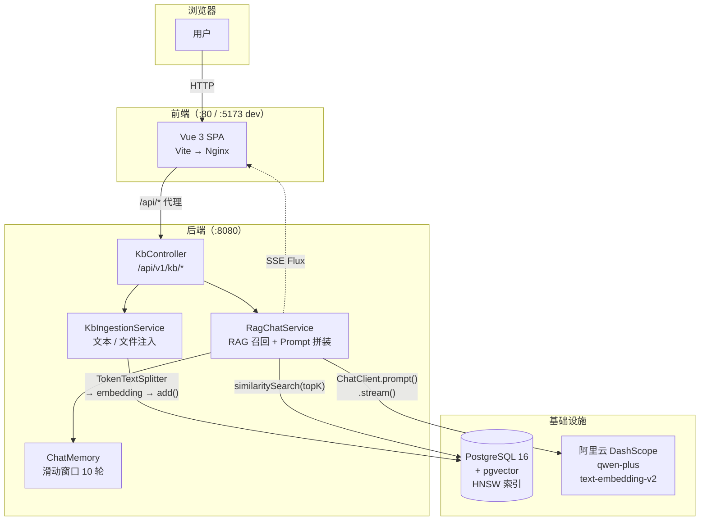

<div align="center">

# RAG-Nexus

[](https://spring.io/projects/spring-boot)
[](https://docs.spring.io/spring-ai/reference/)
[](https://vuejs.org/)
[](https://github.com/pgvector/pgvector)
[](src/test/java/com/ragnexus/kb)

**基于 Spring AI 与 pgvector 的全栈文本知识库 RAG 原型**

围绕文本与文件入库、向量检索、同步 / SSE 问答和 Vue 3 前端展开。文件选择器支持 TXT / MD / DOCX / PDF；已有文件验证覆盖 TXT、MD、DOCX 和有文本层的 PDF。旧 DOC 不在当前选择器中，尚未验证；扫描件 PDF 的 OCR 尚未实现。仓库提供 Docker Compose 配置，但整套 Compose 与干净机器首次启动尚未验证。

</div>

---

## 项目定位

这是一个 **v0.5 文本知识库 RAG 原型**：接收文本或文件，切分并写入 pgvector；提问时检索相关切片，再由配置的聊天模型生成回答，并返回来源信息。Vue 3 前端提供文件上传、知识库查看和 SSE 流式对话；后端另提供同步问答接口。

当前重点是展示文本入库到问答的代码路径，不代表已具备生产环境所需的认证、权限、监控或高可用能力。

> ⚠️ **安全警告**：本项目**所有 API 完全开放，无任何认证 / 鉴权 / 限流**，且全局异常处理已脱敏但仍非生产级。
> 仅限**本地或可信内网**运行。若需公网访问，请自行在前面加一层反向代理鉴权（nginx basic auth / API gateway / OAuth），
> 切勿将 8080 端口直接暴露到公网，否则任何人都能消耗你的 LLM 配额或篡改知识库。

---

## 核心功能

### 代码中已有能力

| 功能 | 说明 |
|------|------|
| **文本注入** | 接收原始文本，按 Token 分块后向量化写入 pgvector |
| **文件上传** | 后端使用 Apache Tika 提取文件文本后分块；已有运行验证覆盖 TXT、MD、DOCX 和有文本层的 PDF；无可索引文本时返回 HTTP 400 |
| **RAG 问答** | 向量相似度召回 Top-K 切片，拼装 System Prompt 后调用 LLM 生成回答 |
| **SSE 流式问答** | 基于 `Flux<String>` 的 Server-Sent Events，前端实时渲染，支持手动中断 |
| **多轮对话记忆** | `MessageWindowChatMemory` 滑动窗口，每个 sessionId 保留最近 10 轮上下文 |
| **防幻觉约束** | System Prompt 明确限定"仅依据检索片段作答"；检测到异常回答时降级为直接引用证据片段 |
| **知识库统计** | 查询总 chunk 数、总文档数及各文档 chunk 分布 |
| **已入库文本预览** | 按文件名查看向量库内的切片文字；每份最多 50 个切片、每片最多 1200 个字符。当前没有可靠的原文切片序号，不能还原原文顺序；同名文档会合并展示 |
| **来源溯源** | 每条 chunk 写入 `docName / author / sourceType` metadata，问答回包携带 `citations` |
| **Vue 3 前端** | 浅色界面，含文件上传、知识库切片预览、流式对话和 Markdown 渲染 |
| **Docker Compose** | 配置了 PostgreSQL + pgvector、Python 辅助容器、Spring Boot 和 Vue + Nginx 四个服务；本轮未验证整套启动 |

### 暂未实现

| 功能 | 说明 |
|------|------|
| OCR | 尚未实现；当前只验证有文本层的 PDF，扫描件 / 图片 PDF 的 OCR 是后续目标 |
| 权限与认证 | 所有 API 当前完全开放，无 Spring Security |
| 持久化会话历史 | 会话记忆为内存级别，后端重启后丢失 |
| 监控与可观测性 | 无 Prometheus / 链路追踪等配置 |

### 测试代码与已有验证记录

仓库当前有 9 个 Controller 层 `@WebMvcTest` 切片测试、2 个入库服务单元测试、1 个流式问答服务单元测试和 2 个切片预览查询单元测试，共 14 项；覆盖请求校验、无可索引文本拒绝、流式空白增量处理、切片预览参数化查询与预览上限。历史记录显示，2026-09-23 曾在 JDK 21 下的隔离源码副本运行 `mvn -o -Dtest=KbControllerTest,KbIngestionServiceTest test`，9 个测试通过（0 失败、0 错误、0 跳过）；该记录只包含当时指定的两类测试。本次在当前 checkout 执行 `SPRING_PROFILES_ACTIVE=ollama-trial mvn -o -q test`，14 项通过（0 失败、0 错误、0 跳过），不是干净机器或完整 Compose 验收。

上述自动化测试本身未覆盖真实数据库、LLM、完整 RAG 链路或浏览器端到端流程；下方本地手动试跑不等同于自动化端到端测试。

### 集成与运行验证记录（2026-09-23）

- 本地 Ollama 与临时 pgvector 试跑使用合成 TXT：浏览器通过 Vite 同源接口上传并写入 1 个切片；知识库列表的切片预览接口返回该文件的已入库文字并标明顺序边界；SSE 问答 HTTP 200，完整结束且无回退或错误提示。收到部分回答后手动中断，已生成内容保留，界面恢复停止状态；同步问答返回 HTTP 200 和来源引用。
- 此前还曾在临时 PostgreSQL / pgvector、Spring Boot 和本地 Ollama 模型上，以合成资料验证 TXT、MD、DOCX、有文本层的 PDF 各写入 1 个切片，回答带来源；前端类型检查与生产构建曾通过（`vue-tsc -b --pretty false`、`vite build`）。
- 尚未验证：整套 Docker Compose、干净机器首次启动、旧 DOC 文件、扫描件 OCR、托管模型服务及真实用户数据。此前验证没有调用 OpenAI / DashScope。

---

## 技术栈

| 层 | 技术 |
|----|------|
| **后端** | Spring Boot 3.4 / Java 17 / Spring AI 1.0 / Lombok |
| **前端** | Vue 3.5 / TypeScript / TailwindCSS 3.4 / Vite 5.4 |
| **AI 框架** | Spring AI（ChatClient / VectorStore / MessageChatMemoryAdvisor） |
| **LLM / Embedding** | 阿里云 DashScope `qwen-plus` + `text-embedding-v2`（1536 维）；兼容 OpenAI API |
| **向量存储** | PostgreSQL 16 + pgvector（HNSW 索引 + 余弦距离） |
| **文档解析** | Apache Tika（spring-ai-tika-document-reader） |
| **辅助容器** | Docker Compose 另定义 Python 服务；不属于本版本文本主流程，未在本轮验证 |
| **部署** | Docker Compose / 多阶段 Dockerfile（Java + Python + Vue/Nginx）；整套启动尚未验证 |
| **API 文档** | Swagger UI（springdoc-openapi 2.6） |

---

## 系统架构



Compose 文件另定义了一个 Python 辅助容器；它不在下方展示的 v0.5 文本主链路中，且整套 Compose 尚未验证。

---

## 处理链路

### 内容注入链路

```
[文本] POST /api/v1/kb/ingest
    └─→ TokenTextSplitter（默认 chunkSize=500，可由请求指定）
         └─→ 写入 metadata: {docName, author, sourceType}
              └─→ EmbeddingModel（仓库 docker profile 配置为 1536 维）
                   └─→ pgvector vector_store（HNSW + 余弦距离）

[文件] POST /api/v1/kb/upload
    └─→ Apache Tika 提取文本
         └─→ 已验证格式：TXT / MD / DOCX / 有文本层的 PDF
              └─→ 同一分块、metadata、embedding 与 pgvector 写入流程

扫描件 PDF 的 OCR 尚未实现。
```

### 问答链路

```
用户提问 POST /api/v1/kb/chat (同步) 或 /chat/stream (SSE)
    └─→ vectorStore.similaritySearch(query, topK)    ← 向量召回
         └─→ buildRagSystemPrompt(召回片段)           ← Prompt 拼装
              约束：仅依据检索片段作答，不足以判断则明确说明
              └─→ ChatClient.prompt()
                   + MessageChatMemoryAdvisor         ← 注入多轮记忆
                   + temperature / topK (请求级可配)
                   └─→ qwen-plus 推理
                        ├─→ 同步返回 KbChatResponse {answer, citations}
                        └─→ SSE 流式 Flux<String> → 前端 ReadableStream
                             └─→ normalizeGarbledAnswer() 乱码兜底
```

---

## 实现说明

**1. 聊天模型与 Embedding 接入**

后端通过 Spring AI 的 `ChatClient` 和 `VectorStore` 完成聊天与向量检索。本次 Ollama profile 下的本地试跑不证明 Docker profile 中的 DashScope 配置、托管模型或其他兼容服务可直接运行。

**2. 检索上下文与来源返回**

`RagChatService` 将相似度检索到的切片加入提示词，并从 metadata 汇总来源。提示词约束模型依据检索内容回答；这不能保证模型回答始终正确。

**3. 同步与流式问答接口**

后端提供同步回答和 `Flux<String>` 流式接口，前端使用 `fetch`、`ReadableStream` 与 `AbortController` 实现逐段显示和中断；本轮本地浏览器试跑已用合成资料验证完整 SSE 答复与手动中断，具体边界见上文。

**4. 文本与文件共用分块写入逻辑**

文本和 Tika 提取结果都会经过 `TokenTextSplitter`，并写入 `docName / author / sourceType` metadata，再调用 `VectorStore.add()`。

**5. pgvector 检索配置**

配置使用 HNSW 索引和余弦距离；向量维度由仓库配置指定。建表与索引初始化依赖 Spring AI 启动配置，整套首次启动尚未验证。

**6. Compose 拓扑**

`docker-compose.yml` 定义 PostgreSQL + pgvector、Python 辅助容器、Spring Boot 后端和 Vue + Nginx 前端，并为数据库配置健康检查。此处描述的是配置，不代表整套 Compose 已通过运行验收。

---

## 本地启动

### 方式一：Docker Compose（推荐）

**前置条件：** Docker Compose、DashScope API Key。当前 Compose 启用 `docker` profile，配置为 DashScope Compatible Mode、`qwen-plus` 和 `text-embedding-v2`。以下是仓库配置对应的启动命令；整套 Compose 和干净机器首次启动尚未验证。

```bash
git clone https://github.com/Yorushikamimimi/rag-nexus.git
cd rag-nexus

# docker-compose.yml 要求宿主机提供 AI_API_KEY
export AI_API_KEY="YOUR_DASHSCOPE_API_KEY"

docker-compose up -d --build
```

| 服务 | 地址 |
|------|------|
| 前端 | http://localhost |
| 后端 API | http://localhost:8080 |
| Swagger UI | http://localhost:8080/swagger-ui.html |
| Python 辅助容器 | Compose 映射端口 `8000`（行为未在本轮验证） |

### 方式二：本地开发（逐服务启动）

**前置条件：** JDK 17+、Maven 3.8+、Node.js 18+、Docker。以下步骤覆盖文本入库和问答主链路。

**第一步：启动 pgvector 数据库**

```bash
docker run -d --name rag-nexus-pg \
  -e POSTGRES_USER=postgres \
  -e POSTGRES_PASSWORD=postgres \
  -e POSTGRES_DB=postgres \
  -p 5433:5432 \
  pgvector/pgvector:pg16

docker exec rag-nexus-pg psql -U postgres -c "CREATE EXTENSION IF NOT EXISTS vector;"
```

> 之后用 `docker start rag-nexus-pg` 启动，不要重复 `docker run`（会丢失数据）。

**第二步：创建 `src/main/resources/application-local.yml`**（已被 `.gitignore` 忽略，需手动创建）

```yaml
spring:
  datasource:
    url: jdbc:postgresql://localhost:5433/postgres
    username: postgres
    password: postgres
  ai:
    openai:
      base-url: https://dashscope.aliyuncs.com/compatible-mode  # 末尾不加 /v1
      api-key: <你的 DashScope API Key>
      chat:
        options:
          model: qwen-plus
          temperature: 0.3
      embedding:
        options:
          model: text-embedding-v2
    vectorstore:
      pgvector:
        index-type: HNSW
        distance-type: COSINE_DISTANCE
        dimensions: 1536
        initialize-schema: true
```

**第三步：分终端启动后端和前端**

```bash
# 终端 1：Spring Boot 后端
mvn spring-boot:run

# 终端 2：Vue 前端
cd rag-nexus-web && npm install && npm run dev
```

前端访问：http://localhost:5173

---

## 关键接口

> 以下列出 README 覆盖的 v0.5 文本问答主流程接口。完整接口文档见 Swagger UI：`http://localhost:8080/swagger-ui.html`

| 方法 | 路径 | 说明 |
|------|------|------|
| `POST` | `/api/v1/kb/ingest` | 文本分块入库 |
| `POST` | `/api/v1/kb/upload` | 文件上传入库（Tika 解析） |
| `POST` | `/api/v1/kb/chat` | RAG 同步问答 |
| `POST` | `/api/v1/kb/chat/stream` | RAG SSE 流式问答 |
| `GET`  | `/api/v1/kb/stats` | 知识库统计信息 |
| `GET`  | `/api/v1/kb/chunks?docName=...` | 查询指定文件的已入库文本切片（有条数和字符上限） |

**问答请求示例（`/chat`）：**

```json
{
  "query": "这个项目的核心技术是什么？",
  "sessionId": "user-abc-123",
  "topK": 5,
  "temperature": 0.3
}
```

**问答响应示例：**

```json
{
  "code": 200,
  "message": "success",
  "data": {
    "answer": "根据检索片段，核心技术包括...",
    "citations": ["技术文档_v1.pdf", "架构说明.txt"]
  }
}
```

---

## 目录结构

```
rag-nexus/
├── src/                              # Spring Boot 后端
│   └── main/java/com/ragnexus/
│       ├── config/AiConfig.java      # ChatModel / ChatClient Bean 显式注册
│       └── kb/
│           ├── controller/           # REST 端点
│           ├── service/              # 注入 / 查询 / RAG 对话
│           ├── domain/dto/           # 请求响应 DTO
│           ├── common/Result.java    # 统一响应封装
│           └── config/              # 会话记忆配置
├── rag-nexus-web/                    # Vue 3 前端（含 Dockerfile + nginx.conf）
├── examples/test-docs/               # 虚构测试资料与提问示例
├── scripts/
│   ├── scraper_service.py            # Python 辅助服务
│   └── batch_ingest_agent.py         # 辅助批量导入脚本（本地运行）
├── docs/
│   ├── DECISIONS.md                  # 架构决策记录
│   └── archive/                      # 归档文件（数据迁移备份等）
├── docker-compose.yml                # 定义 4 个服务的编排配置
├── Dockerfile                        # Spring Boot 多阶段构建
├── Dockerfile.python                 # Python 辅助服务镜像
├── init-pgvector.sql                 # pgvector 扩展初始化
└── requirements-scraper.txt         # Python 依赖
```

---

## 已知问题

| 问题 | 说明 |
|------|------|
| `overlap` 参数无效 | `KbIngestRequest` 定义了 `overlap` 字段，但 `TokenTextSplitter` 当前未读取，分块时不生效 |
| 扫描件 PDF / OCR | 当前仅处理已提取到的文本；扫描件 OCR 尚未实现，列为后续目标 |
| 会话记忆重启丢失 | `InMemoryChatMemoryRepository` 不持久化，后端重启后所有对话历史消失 |
| 中文乱码兜底 | 特定场景下 LLM 回答含乱码，当前通过 `normalizeGarbledAnswer()` 运行时清洗，根本原因仍在排查 |

> 系统完整的失败模式分析（含代码级根因与改进方向）见 → [docs/failure-cases.md](docs/failure-cases.md)

---

## 后续优化方向

- [ ] 接入 OCR（如 Tesseract）支持扫描件 PDF
- [ ] 会话历史持久化（Redis 或数据库存储）
- [ ] 添加 Spring Security 基础权限控制
- [ ] `overlap` 参数接入 `TokenTextSplitter`，修复分块重叠逻辑
- [ ] 支持知识库文档删除接口
- [ ] RAG 召回效果评估（Recall@K 等指标）

---
