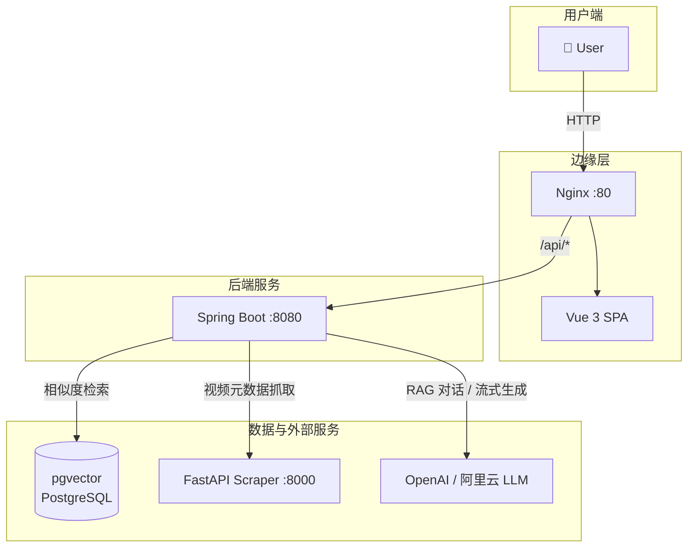

<div align="center">

# Rag-Nexus: Yorushika Concept Engine

[](https://spring.io/projects/spring-boot)
[](https://vuejs.org/)
[](https://fastapi.tiangolo.com/)
[](https://www.postgresql.org/)
[](https://github.com/pgvector/pgvector)
[](LICENSE)

> **献给 Yorushika 的数字灵魂：基于高维向量检索与大模型记忆的全栈概念引擎**

*A full-stack RAG concept engine powered by vector search, LLM memory, and multimodal ingestion.*

</div>

---

## ✨ 核心特性

| 特性 | 描述 |
|------|------|
| **云原生微服务架构** | Spring Boot 3.x + FastAPI 双擎解耦，Java 与 Python 各司其职，容器化一键编排 |
| **防幻觉 RAG 检索引擎** | pgvector HNSW 索引 + 余弦相似度召回，知识库切片精准注入 System Prompt |
| **Agentic 状态化记忆** | `MessageChatMemoryAdvisor` 深度指代消解，多轮对话上下文无缝衔接 |
| **多模态数据炼丹炉** | yt-dlp 视频流抓取（B 站 / YouTube）+ Tika 本地 PDF/TXT 解析，一站式知识注入 |
| **极速丝滑的流式响应** | 基于 `Flux` 与 SSE 的实时打字机渲染，消除等待焦虑 |

---

## 🏗 架构设计



**调用链路**：`User → Nginx/Vue → Spring Boot → pgvector | FastAPI | LLM`

---

## 🚀 快速开始

### 前置要求

- Docker & Docker Compose
- `OPENAI_API_KEY`（或配置阿里云 DashScope 的 `AI_API_KEY`）

### 一键部署

```bash
# 克隆仓库
git clone https://github.com/your-org/rag-nexus.git && cd rag-nexus

# 设置 API Key（必需）
export OPENAI_API_KEY=sk-xxx

# 一键构建并启动
docker-compose up -d --build
```

### 访问入口

| 服务 | 地址 |
|------|------|
| 前端 | http://localhost |
| 后端 API | http://localhost:8080 |
| Swagger UI | http://localhost:8080/swagger-ui.html |
| Python 抓取服务 | http://localhost:8000 |

---

## 📁 项目结构

```
rag-nexus/
├── src/                    # Spring Boot 后端
├── rag-nexus-web/          # Vue 3 前端
├── scraper_service.py      # FastAPI 抓取微服务
├── docker-compose.yml      # 容器编排
├── Dockerfile              # Java 多阶段构建
├── Dockerfile.python       # Python 服务
└── init-pgvector.sql       # pgvector 扩展初始化
```

---

## 📄 License

[MIT](LICENSE)
